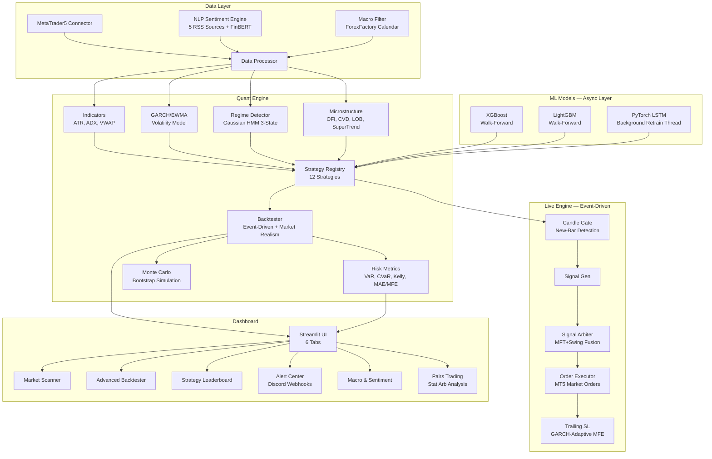
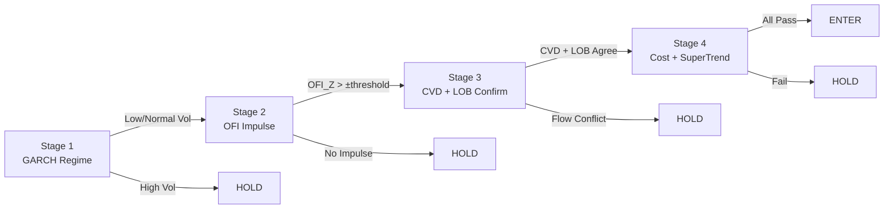

# Institutional Quant Engine

Event-driven quantitative trading system with HMM regime detection, GARCH volatility modeling, ML-powered signal generation, and multi-source NLP sentiment analysis.

---

## Architecture



## Strategies

| # | Strategy | Type | ML | Key Technique |
|---|---|---|---|---|
| 1 | **Ultimate MFT** | Microstructure | — | 4-stage cascade: GARCH regime → OFI impulse → CVD confirmation → SuperTrend gate |
| 2 | **Ultimate Swing** | Deep Learning | PyTorch LSTM | Decoupled async ML — background retrain, fast inference only in hot path |
| 3 | **Composite Alpha** | Multi-factor | — | 5-factor fusion with ADX-adaptive weighting and GARCH-scaled SL/TP |
| 4 | **LSTM Swing** | Deep Learning | PyTorch LSTM | Walk-forward trained sequence model for daily/H4 swing trading |
| 5 | **Regime Switch** | Meta-Strategy | HMM | GARCH-scaled adaptive switching between momentum and mean-reversion |
| 6 | **XGB Breakout** | ML Breakout | XGBoost | Walk-forward classifier with 13-feature matrix |
| 7 | **LGBM Arab Scalp** | ML Scalper | LightGBM | SuperTrend + Weis Wave Volume with LightGBM confirmation |
| 8 | **Pairs Trading** | Stat Arb | — | Engle-Granger cointegration + Ornstein-Uhlenbeck half-life |
| 9 | **MTF Momentum** | Trend | — | Slow MA trend + fast-RSI pullback entry |
| 10 | **VWAP Bounce** | Reversion | — | Session-reset VWAP band bounce with volume confirmation |
| 11 | **SMC Breakout** | Breakout | — | Smart Money Concepts breakout with ATR stops |
| 12 | **ZScore Rev** | Reversion | — | Z-score extremes with RSI + ADX regime filter |

## Mathematical Framework

### Hidden Markov Model — Regime Detection

The system classifies market conditions into 3 hidden states using a Gaussian HMM.

**Observation model.** Each bar produces features:

$$ \mathbf{x}_t = \begin{bmatrix} r_t \\ \sigma_t \end{bmatrix}, \quad r_t = \frac{P_t - P_{t-1}}{P_{t-1}}, \quad \sigma_t = \text{std}(r, 20) $$

**Emission probability** for state $k$:

$$ P(\mathbf{x}_t \mid S_t = k) = \mathcal{N}(\mathbf{x}_t; \mu_k, \Sigma_k) $$

**Transition matrix** $\mathbf{A} \in \mathbb{R}^{3 \times 3}$:

$$ A_{ij} = P(S_t = j \mid S_{t-1} = i) $$

Parameters $\{\mu_k, \Sigma_k, \mathbf{A}\}$ are estimated via the **Baum-Welch algorithm** (Expectation-Maximization). States are labelled by sorting on mean return: $\text{bear} < \text{range} < \text{bull}$.

---

### GARCH(1,1) — Conditional Volatility

$$ \sigma_t^2 = \omega + \alpha r_{t-1}^2 + \beta \sigma_{t-1}^2 $$

| Parameter | Meaning | Default |
|---|---|---|
| $\omega$ | Long-run variance floor | $10^{-5}$ |
| $\alpha$ | Reaction coefficient (shock sensitivity) | $0.05$ |
| $\beta$ | Persistence coefficient (memory) | $0.90$ |

**Stationarity constraint:** $\alpha + \beta < 1$.

**EWMA (RiskMetrics) variant:**

$$ \sigma_t^2 = \lambda \sigma_{t-1}^2 + (1 - \lambda) r_{t-1}^2, \quad \lambda = 0.94 $$

**Application in strategies:** Adaptive SL/TP scaling:

$$ \text{SL}_t = \text{Close}_t - \underbrace{\frac{\hat{\sigma}_t}{\bar{\sigma}_{60}}}_{\text{GARCH scale}} \cdot m_{\text{SL}} \cdot \text{ATR}_t $$

---

### Ultimate MFT — Cascading Microstructure Gate

The MFT strategy uses a strict 4-stage cascade.



| Stage | Gate | Configurable Param | Default |
|---|---|---|---|
| 1 | GARCH vol ratio ≤ cutoff | `garch_high_vol_cutoff` | 1.5 |
| 2 | OFI_Z > ± threshold | `ofi_impulse_threshold` | 1.0 |
| 3 | CVD slope z + LOB z agree | `cvd_confirm_threshold`, `lob_confirm_threshold` | 0.3, 0.3 |
| 4 | ATR > cost × mult, SuperTrend, Volume floor | `cost_hurdle_mult`, `vol_floor_mult` | 2.5, 1.2 |

**Active exits:** OFI reversal (flow collapse) or Chandelier exit (configurable ATR mult).

---

### Cointegration — Pairs Trading

**Engle-Granger two-step procedure:**

1. OLS regression on log-normalized prices:

$$ \log \tilde{Y}_t = \alpha + \beta \cdot \log \tilde{X}_t + \varepsilon_t $$

2. ADF test on residuals $\varepsilon_t$. If $p < 0.10$, the pair is cointegrated.

**Log-normalization** (prevents scale bias):

$$ \tilde{Y}_t = \frac{\log Y_t - \overline{\log Y}}{\text{std}(\log Y)}, \quad \tilde{X}_t = \frac{\log X_t - \overline{\log X}}{\text{std}(\log X)} $$

**Z-score of the spread:**

$$ Z_t = \frac{S_t - \bar{S}_n}{\sigma_{S,n}}, \quad S_t = \tilde{Y}_t - \beta \tilde{X}_t $$

**Ornstein-Uhlenbeck half-life:**

$$ \Delta S_t = \varphi S_{t-1} + \varepsilon_t \implies \tau_{1/2} = -\frac{\ln 2}{\ln(1 + \varphi)} $$

---

### XGBoost Walk-Forward Training

**Features (13):**

| Feature | Formula |
|---|---|
| Vol_Ratio | $V_t / \text{MA}(V, 5)$ |
| Close_Diff | $C_t - C_{t-5}$ |
| RSI_14 | Wilder-smoothed RSI |
| ATR_14 | $\text{EMA}(\text{TrueRange}, 14)$ |
| BB_%B | $(C_t - L_{\text{BB}}) / (U_{\text{BB}} - L_{\text{BB}})$ |
| BB_Width | $(U_{\text{BB}} - L_{\text{BB}}) / M_{\text{BB}}$ |
| ADX_14 | Smoothed $\vert DI^+ - DI^- \vert / (DI^+ + DI^-)$ |
| Volume_Delta | $\frac{C - O}{H - L} \cdot V$ |
| Return_Autocorr | $\text{corr}(r_t, r_{t-1}; w=20)$ |
| Return_5 | $\ln(C_t / C_{t-5})$ |
| Variance_Ratio | $\text{std}(C, 5) / \text{std}(C, 20)$ |
| GARCH_Vol | $\hat{\sigma}_t$ from GARCH(1,1) |
| Sentiment_Score | FinBERT aggregate |

**MFE-based target:**

$$ y_t = \begin{cases} 1 & \text{if } \min_{j \in [1,H]} \{j : H_{t+j} \geq C_t + m_{\text{TP}} \cdot \text{ATR}_t\} < \min_{j} \{j : L_{t+j} \leq C_t - m_{\text{SL}} \cdot \text{ATR}_t\} \\ 0 & \text{otherwise} \end{cases} $$

**Walk-forward protocol:** 70% initial train → predict next 1000 bars → retrain on expanded window → repeat. Purged gap = $2H$ bars to prevent leakage.

---

### LSTM — Deep Learning Swing Model

**Architecture:**

$$ \mathbf{x}_t \in \mathbb{R}^{30 \times 6} \longrightarrow \text{LSTM}(128, \text{2 layers}) \longrightarrow \mathbf{h}_T \longrightarrow \text{FC}(64) \longrightarrow \text{FC}(1) \longrightarrow \sigma \longrightarrow \hat{p}_t \in [0, 1] $$

**LSTM cell equations:**

$$ \begin{aligned}
\mathbf{f}_t &= \sigma(\mathbf{W}_f [\mathbf{h}_{t-1}, \mathbf{x}_t] + \mathbf{b}_f) & \text{(forget gate)} \\
\mathbf{i}_t &= \sigma(\mathbf{W}_i [\mathbf{h}_{t-1}, \mathbf{x}_t] + \mathbf{b}_i) & \text{(input gate)} \\
\tilde{\mathbf{C}}_t &= \tanh(\mathbf{W}_C [\mathbf{h}_{t-1}, \mathbf{x}_t] + \mathbf{b}_C) & \text{(candidate)} \\
\mathbf{C}_t &= \mathbf{f}_t \odot \mathbf{C}_{t-1} + \mathbf{i}_t \odot \tilde{\mathbf{C}}_t & \text{(cell state)} \\
\mathbf{o}_t &= \sigma(\mathbf{W}_o [\mathbf{h}_{t-1}, \mathbf{x}_t] + \mathbf{b}_o) & \text{(output gate)} \\
\mathbf{h}_t &= \mathbf{o}_t \odot \tanh(\mathbf{C}_t) & \text{(hidden state)}
\end{aligned} $$

---

### Risk Metrics

**Value-at-Risk (Historical):**

$$ \text{VaR}_\alpha = \text{Percentile}(r, (1-\alpha) \times 100) $$

**Conditional VaR (Expected Shortfall):**

$$ \text{CVaR}_\alpha = \mathbb{E}[r \mid r \leq \text{VaR}_\alpha] $$

**Cornish-Fisher VaR** (fat-tail adjustment):

$$ z_{\text{CF}} = z_\alpha + \frac{z_\alpha^2 - 1}{6}\, S + \frac{z_\alpha^3 - 3z_\alpha}{24}\, K - \frac{2z_\alpha^3 - 5z_\alpha}{36}\, S^2 $$

$$ \text{VaR}_{\text{CF}} = \mu + z_{\text{CF}} \cdot \sigma $$

where $S = \text{skewness}(r)$, $K = \text{excess kurtosis}(r)$.

**Sharpe Ratio:**

$$ \text{Sharpe} = \frac{\mathbb{E}[r]}{\sigma(r)} \cdot \sqrt{252} $$

**Sortino Ratio:**

$$ \text{Sortino} = \frac{\mathbb{E}[r]}{\sigma_{\text{down}}(r)} \cdot \sqrt{252}, \quad \sigma_{\text{down}} = \text{std}(r \mid r < 0) $$

**Calmar Ratio:**

$$ \text{Calmar} = \frac{r_{\text{ann}}}{|\text{MaxDD}|} $$

**Kelly Criterion:**

$$ f^* = \frac{p \cdot b - q}{b}, \quad b = \frac{\bar{w}}{\bar{l}}, \quad q = 1 - p $$

Capped at $f^* \leq 0.25$ (fractional Kelly).

---

### Market Realism in Backtester

| Component | Model |
|---|---|
| **Slippage** | $S = s_{\text{base}} \cdot \left(\frac{\text{ATR}}{\overline{\text{ATR}}}\right)^{0.5} \cdot \left(\frac{\bar{V}}{V}\right)^{0.5} \cdot P$ |
| **Commission** | Per-lot $\times 2$ (entry + exit) |
| **Spread** | $\Delta_{\text{spread}} \cdot 10^{-4} \cdot P$ |
| **Swap** | Daily overnight charge from MT5 |
| **Execution delay** | 1-bar lag between signal and fill |
| **Fill probability** | 98% partial fill simulation |
| **MFE Trailing** | Dynamic SL tightens as trade moves in favour |

---

## NLP Sentiment Engine

5 free RSS sources aggregated with weighted FinBERT scoring:

$$ \text{Score}_{\text{final}} = \frac{\sum_{i \in \mathcal{A}} w_i \cdot s_i}{\sum_{i \in \mathcal{A}} w_i} $$

where $\mathcal{A}$ is the set of sources that returned data.

| Source | Weight $w_i$ |
|---|---|
| Google News | $0.35$ |
| Yahoo Finance | $0.25$ |
| Reddit r/wallstreetbets | $0.15$ |
| Reddit r/stocks | $0.15$ |
| Investing.com | $0.10$ |

---

## Installation

```bash
git clone https://github.com/Ad1xon/Trading_dashboard.git
cd PythonProject
pip install -r requirements.txt
```

**Requirements:** Python 3.11+, MetaTrader5 terminal running on Windows.

## Usage

```bash
streamlit run dashboard/app.py
```

6 dashboard tabs:
1. **Market Scanner** — Multi-symbol VWAP/RSI/ATR scanner
2. **Advanced Backtester** — Full strategy backtesting with risk metrics
3. **Strategy Leaderboard** — Multi-strategy comparison on same data
4. **Alert Center** — Discord webhook notifications
5. **Macro & Sentiment** — NLP + ForexFactory calendar
6. **Pairs Trading** — Cointegration analysis with spread visualization

## Testing

```bash
pytest tests/ -v
```

## Instruments (30+)

FX Majors · Indices (S&P, DAX, FTSE, Nasdaq) · Commodities (Gold, Silver, Oil, Gas) · Equities (AAPL, TSLA, NVDA, MSFT, AMZN, GOOG, META) · Crypto (BTC, ETH, SOL, BNB, XRP, ADA)

---
*Disclaimer: This software is for research and educational purposes only. Do not deploy algorithms on live accounts without rigorous paper-trading and capital risk assessment.*